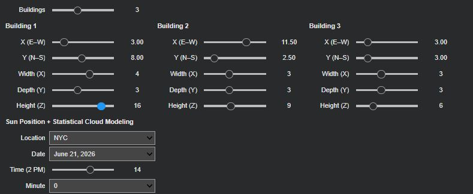
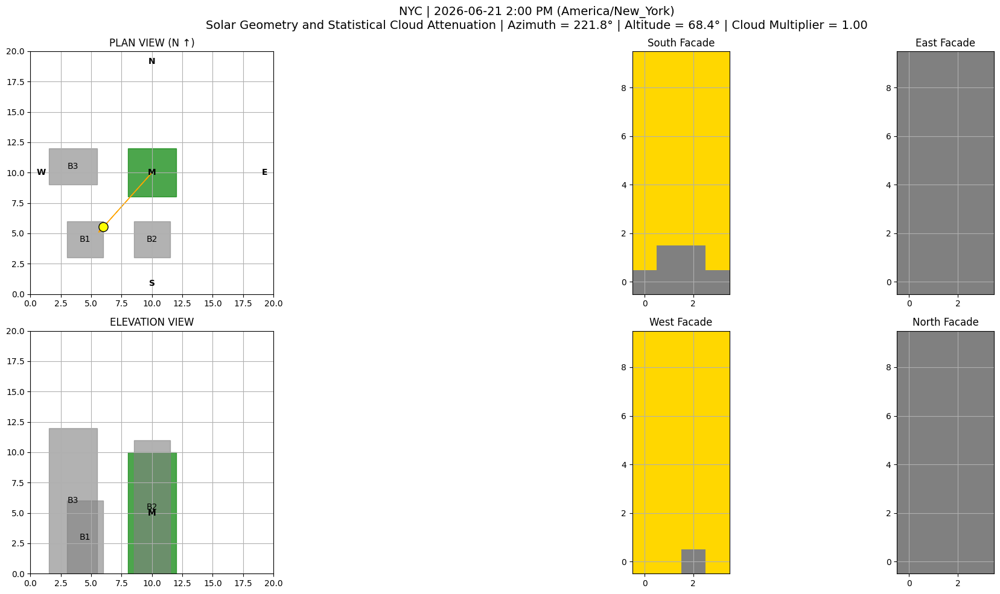
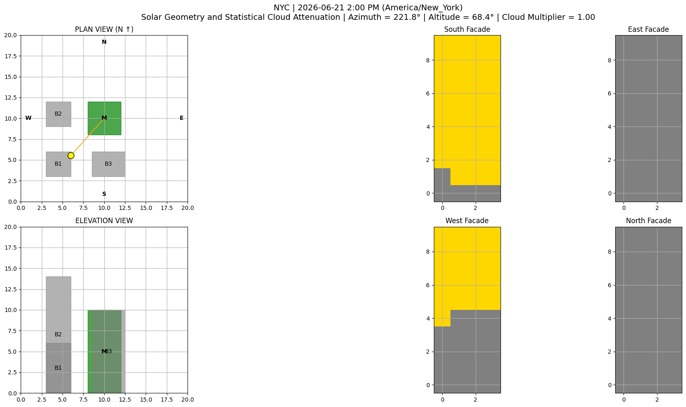
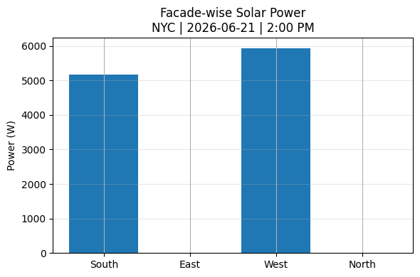
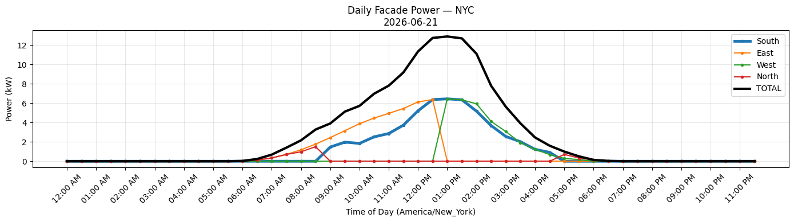

# Vertical Façade Solar Analysis Workflow  
### *A Geometry-Aware and Cloud-Adjusted Solar Assessment Pipeline*

This repository presents a **reproducible computational workflow** for analyzing the **solar energy potential of vertical building façades**. The workflow integrates **deterministic solar geometry**, **urban shading analysis**, and **cloud-adjusted irradiance** to support **façade-level comparative evaluation** in dense urban environments.

The implementation is designed for **Google Colab** and is intended as a **design-support and early-stage feasibility tool**, rather than a prediction of absolute building energy sufficiency.

---

##  Execution Environment

This workflow is implemented and tested in **Google Colab**.

**If running locally, ensure:**
- *Python 3.9+*
- *Jupyter Notebook or JupyterLab*

Each cell explicitly installs or imports the required dependencies.

---

##  Workflow Overview

The complete pipeline follows a structured sequence:

1. Location and date selection  
2. Solar position calculation  
3. Urban shadow evaluation  
4. Cloud-adjusted irradiance retrieval (SoDa / NSRDB)  
5. Façade-level power computation  
6. Daily energy aggregation and visualization  

---

##  CELL 1 — Setup & Solar Position Utilities

This cell installs core Python libraries and defines **solar position utilities**.  
Solar azimuth and altitude are computed using **pvlib’s NREL Solar Position Algorithm**, providing a deterministic and physics-based description of Earth–Sun geometry.

```python
!pip -q install numpy matplotlib ipywidgets pvlib pandas

import numpy as np
import pandas as pd
import matplotlib.pyplot as plt
import ipywidgets as widgets

from pvlib.solarposition import get_solarposition

plt.rcParams["figure.figsize"] = (6, 6)
plt.rcParams["axes.grid"] = True

LOCATIONS = {
    "NYC":   {"lat": 40.7128, "lon": -74.0060, "tz": "America/New_York"},
    "Pune":  {"lat": 18.5204, "lon": 73.8567,  "tz": "Asia/Kolkata"},
    "Paris": {"lat": 48.8566, "lon": 2.3522,   "tz": "Europe/Paris"},
}

def get_sun_position(location, date, hour, minute):
    meta = LOCATIONS[location]
    t = pd.Timestamp(f"{date} {hour:02d}:{minute:02d}", tz=meta["tz"])
    sp = get_solarposition(t, meta["lat"], meta["lon"], method="nrel_numpy")
    return float(sp["azimuth"].iloc[0]), float(sp["apparent_elevation"].iloc[0])

print("Cell 1 ready.")

```

##  CELL 2 — Cloud Attenuation via SoDa / NSRDB

This cell incorporates **atmospheric variability** using the **SoDa (Solar radiation Data) framework**, which leverages irradiance data derived from the **National Solar Radiation Database (NSRDB)**.  

A **cloud attenuation multiplier** is computed by comparing measured global horizontal irradiance (GHI) to corresponding clear-sky values. For simulation dates outside the NSRDB temporal range (2016–2017), SoDa is used to **statistically map future dates to historical irradiance years**, enabling stochastic representation of cloud effects without explicit weather forecasting.

```python
!pip -q install git+https://github.com/Ignacio-Losada/SoDa.git

import soda
from pvlib.location import Location
from pandas.errors import EmptyDataError

_SODA_SITE_CACHE = {}
_NSRDB_CACHE = {}

def get_cloud_multiplier(location, date, hour, minute, soda_year="2016"):
    try:
        meta = LOCATIONS[location]
        tz = meta["tz"]

        # Simulation timestamp (can be future)
        t_sim = pd.Timestamp(f"{date} {hour:02d}:{minute:02d}", tz=tz)

        # Map to NSRDB calibration year
        t_data = t_sim.replace(year=int(soda_year))

        if location not in _SODA_SITE_CACHE:
            _SODA_SITE_CACHE[location] = soda.SolarSite(meta["lat"], meta["lon"])

        site = _SODA_SITE_CACHE[location]

        key = (location, soda_year)
        if key not in _NSRDB_CACHE:
            site.get_nsrdb_data(year=soda_year, leap_year=False, interval="30", utc=False)
            df = site.nsrdb_data.copy()
            df.index = pd.to_datetime(df.index).tz_localize(tz)
            _NSRDB_CACHE[key] = df

        df = _NSRDB_CACHE[key]
        row = df.iloc[df.index.get_indexer([t_data], method="nearest")[0]]
        ghi_actual = float(row["ghi"])

        loc = Location(meta["lat"], meta["lon"], tz=tz)
        ghi_clear = float(loc.get_clearsky(pd.DatetimeIndex([t_sim]))["ghi"].iloc[0])

        return float(np.clip(ghi_actual / max(ghi_clear, 1.0), 0.0, 1.2))

    except (EmptyDataError, KeyError, Exception):
        return 1.0  # conservative fallback (clear sky)

print("Cell 2 ready — cloud attenuation enabled.")

```

##  CELL 4 — Interactive Controls & Simulation Orchestration

This cell defines the **interactive user interface** for the workflow, allowing users to configure building geometry, location, date, and time parameters dynamically. The controls are implemented using **ipywidgets**, enabling real-time updates to the solar geometry, shading, and cloud-adjusted visualization pipeline.

Key features of this cell include:
- Parametric control over the **number, position, and dimensions of surrounding buildings**
- Selection of **location**, **simulation date**, **time**, and **minute resolution**
- Automatic resolution of an internal **cloud calibration year** based on the selected date (hidden from the user)
- A unified `update()` callback that re-renders the full scene whenever any input parameter changes

This interactive layer makes the workflow suitable for **exploratory analysis and comparative design studies**, allowing users to intuitively assess how changes in geometry, time, and context affect façade-level solar availability.

```python
out = widgets.Output()
num_bld = widgets.IntSlider(min=1, max=6, value=3, description="Buildings")

bld_sets = []
bld_box = widgets.HBox()

# ---- BUILDING SLIDERS ----
def make_bld():
    return {
        "x": widgets.FloatSlider(min=0, max=17, step=0.5, value=3, description="X (E–W)"),
        "y": widgets.FloatSlider(min=0, max=17, step=0.5, value=3, description="Y (N–S)"),
        "w": widgets.IntSlider(min=1, max=6, value=3, description="Width (X)"),
        "d": widgets.IntSlider(min=1, max=6, value=3, description="Depth (Y)"),
        "h": widgets.IntSlider(min=1, max=20, value=6, description="Height (Z)"),
    }

def rebuild(n):
    bld_sets.clear()
    cols = []

    for i in range(n):
        s = make_bld()
        for v in s.values():
            v.observe(update, "value")
        bld_sets.append(s)
        cols.append(
            widgets.VBox(
                [widgets.HTML(f"<b>Building {i+1}</b>")] + list(s.values())
            )
        )

    bld_box.children = cols
    update()

# ---- TIME LABEL ----
def hour_label(h):
    if h == 0: return "12 AM"
    if h < 12: return f"{h} AM"
    if h == 12: return "12 PM"
    return f"{h-12} PM"

# ---- DATE RANGE (FUTURE-SAFE) ----
def generate_dates(start_year=2016, end_year=2035):
    dates = pd.date_range(
        f"{start_year}-01-01",
        f"{end_year}-12-31",
        freq="D"
    )
    return [
        (d.strftime("%B %d, %Y"), d.strftime("%Y-%m-%d"))
        for d in dates
    ]

# ---- INTERNAL CLOUD YEAR RESOLUTION ----
def resolve_cloud_year_from_date(date_str):
    year = date_str.split("-")[0]
    if year in ["2016", "2017"]:
        return year
    return "2016"  # statistical baseline

# ---- UPDATE CALLBACK ----
def update(change=None):
    with out:
        clear_output(wait=True)

        time_sl.description = f"Time ({hour_label(time_sl.value)})"
        cloud_year = resolve_cloud_year_from_date(date_dd.value)

        draw_scene(
            [(s["x"].value, s["y"].value, s["w"].value,
              s["d"].value, s["h"].value)
             for s in bld_sets],
            loc_dd.value,
            date_dd.value,
            time_sl.value,
            min_dd.value,
            cloud_year
        )

num_bld.observe(lambda c: rebuild(c["new"]), "value")

# ---- GLOBAL CONTROLS ----
loc_dd = widgets.Dropdown(
    options=list(LOCATIONS.keys()),
    value="NYC",
    description="Location"
)

date_dd = widgets.Dropdown(
    options=generate_dates(),
    value="2026-06-21",
    description="Date"
)

time_sl = widgets.IntSlider(
    min=0,
    max=23,
    step=1,
    value=14,
    description="Time (2 PM)",
    continuous_update=False
)

min_dd = widgets.Dropdown(
    options=[0, 30],
    value=0,
    description="Minute"
)

for w in [loc_dd, date_dd, time_sl, min_dd]:
    w.observe(update, "value")

display(widgets.VBox([
    num_bld,
    bld_box,
    widgets.HTML("<b>Sun Position + Statistical Cloud Modeling</b>"),
    loc_dd,
    date_dd,
    time_sl,
    min_dd,
    out
]))

rebuild(num_bld.value)

print("Cell 4 ready — interactive simulation controls enabled.")

```
After running **Cell 4**, you will see an interactive interface similar to the image below.

This interface allows you to:
- Toggle the **number of surrounding buildings**
- Adjust each building’s **position, footprint, and height**
- Select a **location** from the dropdown
- Change the **date and time** using the sliders

As you move the **time slider**, you will observe real-time changes in:
- Sun position (azimuth and altitude)
- Resulting **shading patterns** on each façade
- The proportion of sunlit vs shaded façade area

**Important note:**  
Every time you modify any slider or building parameter in **Cell 4**, you must **re-run Cell 6 and Cell 7** to obtain updated power and energy results that correspond to the new geometry and sun position.




The two images below show **two different building arrangements** evaluated at the **same location and time**.

They demonstrate how changes in surrounding building geometry alone can significantly alter:
- Façade shading patterns
- Solar exposure distribution
- Downstream power and energy results

This highlights the sensitivity of vertical façade solar performance to **urban context**, even when all environmental parameters remain constant.

<p align="center">
  
  
</p>


##  CELL 5 — Façade-Level Solar Power Model

This cell implements the **physical energy conversion model** used to translate geometric solar availability and atmospheric irradiance into **instantaneous electrical power** generated by each façade.

The formulation combines:
- **Active façade area** derived from the binary shadow masks
- **Clear-sky irradiance**, modulated by the SoDa-derived cloud attenuation factor
- A **vertical projection factor** based on solar altitude to account for incidence on vertical surfaces
- An assumed **photovoltaic conversion efficiency** representative of commercially available silicon PV modules

The resulting power model is intentionally simple, transparent, and interpretable, allowing a direct link between **solar geometry, shading, irradiance, and energy output**. This makes it suitable for comparative façade analysis and early-stage feasibility studies rather than detailed engineering prediction.

```python
from pvlib.location import Location

# ---- PV PARAMETERS ----
PANEL_EFF = 0.18       # 18% PV efficiency (typical silicon module)
PIXEL_AREA = 1.0       # m² per façade grid cell
GHI_REF = 1000         # W/m² (reference irradiance)

def compute_facade_power(facade_grid, location, date, hour, minute, soda_year):
    """
    Computes instantaneous electrical power (W) generated by a façade.

    Parameters:
    - facade_grid : binary shadow mask (1 = sunlit, 0 = shaded)
    - location    : city key
    - date/time   : simulation timestamp
    - soda_year   : NSRDB calibration year for cloud statistics
    """
    az, alt = get_sun_position(location, date, hour, minute)

    # No generation if sun is below horizon
    if alt <= 0:
        return 0.0

    meta = LOCATIONS[location]
    t = pd.Timestamp(f"{date} {hour:02d}:{minute:02d}", tz=meta["tz"])

    # ---- Clear-sky irradiance (physics-based) ----
    loc = Location(meta["lat"], meta["lon"], tz=meta["tz"])
    ghi_clear = float(
        loc.get_clearsky(pd.DatetimeIndex([t]))["ghi"].iloc[0]
    )

    # ---- Cloud attenuation (SoDa / NSRDB) ----
    C = get_cloud_multiplier(
        location, date, hour, minute, soda_year=soda_year
    )

    # ---- Vertical projection factor ----
    vertical_factor = np.sin(np.deg2rad(alt))

    # ---- Effective irradiance on façade ----
    G_eff = ghi_clear * C * vertical_factor

    # ---- Power computation ----
    active_pixels = facade_grid.sum()
    power = (
        active_pixels *
        PIXEL_AREA *
        G_eff *
        PANEL_EFF
    )

    return max(power, 0.0)

print("Cell 5 ready — façade-level power model enabled.")

```

##  CELL 6 — Instantaneous Façade Power Summary

This cell aggregates the **instantaneous electrical power output** computed in Cell 5 across all four façade orientations (North, South, East, West) for a selected simulation time. It serves as a **snapshot evaluation** of façade-wise solar performance under a specific geometric, temporal, and atmospheric configuration.

Key functions of this cell include:
- Computing façade-specific power using the geometry-aware shadow grids and cloud-adjusted irradiance
- Aggregating power values to obtain **total building-level instantaneous output**
- Presenting results numerically and visually through a **bar chart**, enabling direct comparison of orientation-dependent performance at a given moment

This step bridges the detailed per-façade power computation with higher-level comparative analysis and provides immediate insight into how orientation and shading influence vertical solar generation.

```python
def compute_all_facade_powers(buildings, location, date, hour, minute, calib_year):
    """
    Computes instantaneous power output (W) for all façade orientations
    and returns a dictionary with façade-wise and total power.
    """
    az, alt = get_sun_position(location, date, hour, minute)

    facades = {
        "South": compute_facade_shadow_grid(buildings, az, alt, "South", (8, 8), 4, 10),
        "East":  compute_facade_shadow_grid(buildings, az, alt, "East",  (12, 8), 4, 10),
        "West":  compute_facade_shadow_grid(buildings, az, alt, "West",  (8, 8), 4, 10),
        "North": compute_facade_shadow_grid(buildings, az, alt, "North", (8, 12), 4, 10),
    }

    powers = {
        k: compute_facade_power(
            v,
            location,
            date,
            hour,
            minute,
            calib_year
        )
        for k, v in facades.items()
    }

    powers["TOTAL"] = sum(powers.values())
    return powers


# ---- TIME FORMAT UTILITY ----
def format_time_ampm(hour, minute):
    if hour == 0:
        return f"12:{minute:02d} AM"
    if hour < 12:
        return f"{hour}:{minute:02d} AM"
    if hour == 12:
        return f"12:{minute:02d} PM"
    return f"{hour-12}:{minute:02d} PM"


# ---- CURRENT STATE (FROM UI) ----
location   = loc_dd.value
date       = date_dd.value
hour       = time_sl.value
minute     = min_dd.value
calib_year = resolve_cloud_year_from_date(date)

time_str = format_time_ampm(hour, minute)

buildings = [
    (s["x"].value, s["y"].value, s["w"].value, s["d"].value, s["h"].value)
    for s in bld_sets
]

powers = compute_all_facade_powers(
    buildings,
    location,
    date,
    hour,
    minute,
    calib_year
)

# ---- PRINT SUMMARY ----
print("INSTANTANEOUS SOLAR POWER (W)")
print(f"Location : {location}")
print(f"Date     : {date}")
print(f"Time     : {time_str}")
print("-" * 36)

for k in ["South", "East", "West", "North", "TOTAL"]:
    print(f"{k:6s} : {powers[k]:8.1f} W")


# ---- BAR CHART ----
labels = ["South", "East", "West", "North"]
values = [powers[k] for k in labels]

plt.figure(figsize=(6, 4))
plt.bar(labels, values)
plt.ylabel("Power (W)")
plt.title(
    f"Facade-wise Solar Power\n"
    f"{location} | {date} | {time_str}"
)
plt.grid(axis="y", alpha=0.3)
plt.tight_layout()
plt.show()

print("Cell 6 ready — instantaneous façade power summary generated.")

```
After running **Cell 6**, you can expect an output similar to the bar chart shown below.

This visualization represents:
- **Instantaneous electrical power (W)** generated by each façade (North, South, East, West)
- The **total instantaneous building-level power output**

In addition to the bar chart, the cell prints:
- Location
- Date and time
- Façade-wise power values
- Total instantaneous power

This output provides a **snapshot comparison** of façade performance at a specific moment in time.




##  CELL 7 — Daily Energy Aggregation & Visualization

This cell extends the instantaneous façade power computation to a **full-day analysis**, enabling estimation of **daily energy generation (kWh)** for each façade orientation and for the building as a whole. Instantaneous power values are evaluated at **30-minute intervals** over a 24-hour period and temporally integrated to obtain daily energy output.

Key functions of this cell include:
- Time-resolved sampling of façade power across an entire day
- Numerical integration of power (W) to energy (kWh)
- Visualization of **daily power profiles** and **total daily energy** per façade orientation

This step provides a clear, orientation-aware understanding of how solar exposure, shading, and time-of-day effects accumulate into daily energy performance, making it particularly useful for **comparative façade feasibility analysis**.

```python
def compute_daily_energy(
    buildings,
    location,
    date,
    calibration_year,
    step_minutes=30
):
    """
    Computes time-resolved façade power and aggregates it into
    daily energy (kWh) for each façade and the total building.
    """
    meta = LOCATIONS[location]
    tz = meta["tz"]

    t0 = pd.Timestamp(date + " 00:00", tz=tz)
    t1 = t0 + pd.Timedelta(days=1)

    times = pd.date_range(
        t0,
        t1,
        freq=f"{step_minutes}min",
        inclusive="left"
    )

    records = []

    for t in times:
        powers = compute_all_facade_powers(
            buildings,
            location,
            date,
            t.hour,
            t.minute,
            calibration_year
        )

        records.append({
            "time": t,
            "South": powers["South"],
            "East":  powers["East"],
            "West":  powers["West"],
            "North": powers["North"],
            "TOTAL": powers["TOTAL"],
        })

    df_power = pd.DataFrame(records).set_index("time")

    # ---- Temporal integration (W → kWh) ----
    dt_hours = step_minutes / 60.0
    daily_kwh = (df_power * dt_hours / 1000.0).sum().to_dict()

    return df_power, daily_kwh


# ---- CURRENT STATE ----
location         = loc_dd.value
date             = date_dd.value
calibration_year = resolve_cloud_year_from_date(date)
tz               = LOCATIONS[location]["tz"]

buildings = [
    (s["x"].value, s["y"].value, s["w"].value, s["d"].value, s["h"].value)
    for s in bld_sets
]

df_power, daily_kwh = compute_daily_energy(
    buildings,
    location,
    date,
    calibration_year
)

# ---- PRINT DAILY ENERGY SUMMARY ----
print("DAILY ENERGY (kWh)")
print(f"Location : {location}")
print(f"Date     : {date}")
print(f"Timezone : {tz}")
print("-" * 36)

for k in ["South", "East", "West", "North", "TOTAL"]:
    print(f"{k:6s} : {daily_kwh[k]:8.2f} kWh")


# ---- COLOR MAP ----
colors = {
    "South": "#1f77b4",
    "East":  "#ff7f0e",
    "West":  "#2ca02c",
    "North": "#d62728",
    "TOTAL": "black",
}

# ---- PLOT: POWER vs TIME ----
plt.figure(figsize=(14, 4))

plt.plot(
    df_power.index,
    df_power["South"] / 1000.0,
    label="South",
    linewidth=3.0,
    color=colors["South"]
)

for k in ["East", "West", "North"]:
    plt.plot(
        df_power.index,
        df_power[k] / 1000.0,
        label=k,
        linewidth=1.5,
        color=colors[k]
    )

plt.plot(
    df_power.index,
    df_power["TOTAL"] / 1000.0,
    label="TOTAL",
    linewidth=3.0,
    color=colors["TOTAL"]
)

plt.ylabel("Power (kW)")
plt.xlabel(f"Time of Day ({tz})")
plt.title(f"Daily Facade Power — {location} | {date}")
plt.grid(True, alpha=0.3)
plt.legend()
plt.tight_layout()
plt.show()


# ---- BAR CHART: DAILY ENERGY ----
labels = ["South", "East", "West", "North"]
values = [daily_kwh[k] for k in labels]

plt.figure(figsize=(6, 4))
plt.bar(labels, values, color=[colors[k] for k in labels])
plt.ylabel("Energy (kWh)")
plt.title(f"Daily Facade Energy — {location} | {date}")
plt.grid(axis="y", alpha=0.3)
plt.tight_layout()
plt.show()

print("Cell 7 ready — daily energy aggregation and visualization complete.")

```
After running **Cell 7**, the system evaluates façade power across an entire day and aggregates it into **daily energy generation (kWh)**.

You will see:
- A **time-series plot** showing how façade-wise power varies throughout the day
- A **daily energy summary** printed numerically for each façade and the total building

This allows you to understand how instantaneous solar access accumulates into meaningful daily energy output.




